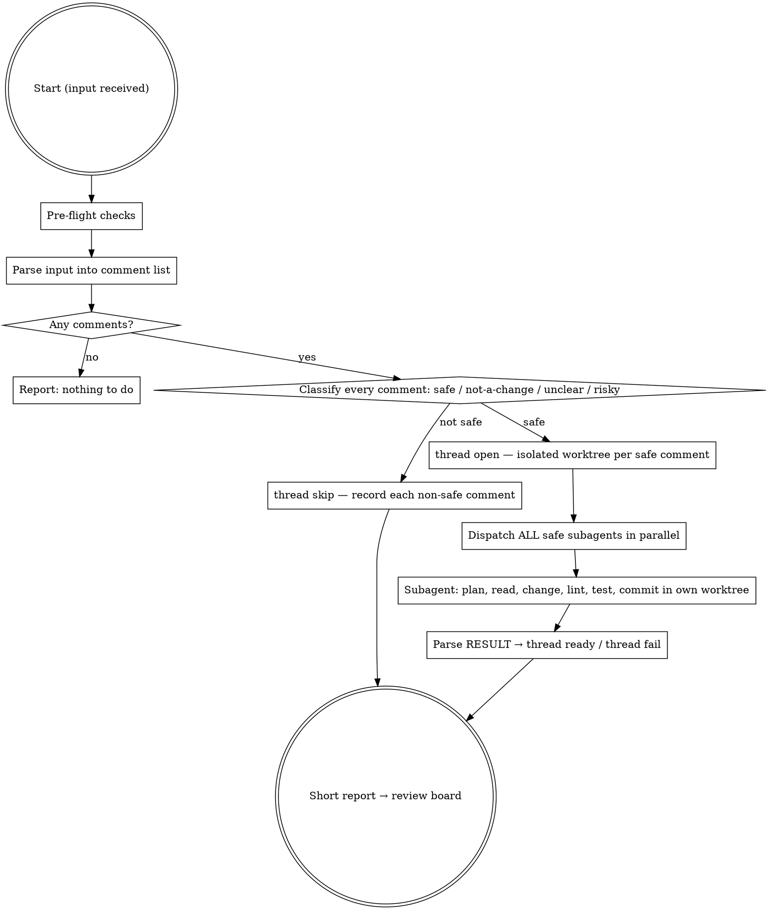

# Handle Pull Request Feedback (Autonomous)

Address a **caller-provided list of review threads** on the PR for the current branch, without prompting the user. Each safe thread gets a fix: a commit in its own isolated worktree, off the PR head, recorded for the review board. Nothing lands on the PR branch — the user approves threads on the board, and the board does the landing. The trade-off vs. the interactive `/handle-pull-request-feedback` command: this skill never blocks for approval, so anything ambiguous, risky, or out-of-scope gets **skipped and recorded on the board** rather than asked about.

This skill assumes the caller has already filtered the input to the threads that need attention this run. It does not fetch from GitHub itself.

## When to use

- Invoked by the github-orchestrator on a `thread-activity` event (the canonical case)
- Any other caller that has a curated thread list and explicit "no need to check in" intent

## When NOT to use

- The user is sitting at the keyboard and wants to discuss the plan — use `/handle-pull-request-feedback` instead
- You don't already have the threads — go fetch them via `/handle-pull-request-feedback` (interactive) instead of bolting fetching onto this skill
- The PR has architectural/design feedback that requires judgement calls
- Tests are failing on `main` (fix that first; don't pile fixes on a broken base)

## Expected input

The caller's prompt contains a PR identifier and a list of **threads** in delimited blocks (the github-orchestrator format is the source of truth — match what it sends):

```
New review thread activity on PR #{pr} in {owner}/{repo}:

--- thread id={thread_key} type={comment_type} author={author} path={path or 'general'} line={line or ''}
{author}: {body}

{author}: {body}
--- thread id=... type=... author=... path=... line=...
{body}
--- end
Use /handle-pull-request-feedback-autonomous to address these threads.
```

Each `--- thread` line starts one thread; everything up to the next `---` line is that thread's comments, oldest first, verbatim — it may span many lines. Fields:

| Field    | Notes                                                                                                                   |
| -------- | ----------------------------------------------------------------------------------------------------------------------- |
| `id`     | The thread's GitHub node id (`PRRT_…`). This names the record: every `thread` CLI call below takes it as `--thread-id`. |
| `type`   | `review` (inline diff thread), `issue` (conversation comment), or `review-summary` (a review's summary body).           |
| `author` | Login of whoever opened the thread. Used for context, not action.                                                       |
| `path`   | File path the thread is anchored to, or the literal string `general` for top-level / non-anchored comments.             |
| `line`   | Line number the thread is anchored to; empty for non-anchored comments and for outdated threads.                        |
| body     | Every comment in the thread, oldest first. The last one is the newest thing the reviewer said.                          |

In the commands below, `R` is the `{owner}/{repo}` and `N` the `{pr}` from the input's first line. Every `thread` CLI call takes both, as `--repo` and `--pr`.

Things the input does **not** contain (don't go look them up):

- Other threads on the PR — only address what's in the input
- Anything about who has replied since; the block you are given is the whole thread as of this poll

If the input is missing or empty, abort and report.

## Process



## Step 1: Pre-flight checks

These are sanity checks on the working tree, not GitHub fetches — the caller is responsible for putting you on the right branch in the right worktree.

- `git status` — fail fast if there are uncommitted changes. Threads branch off HEAD, so uncommitted work would be invisible to every fix — and a dirty tree means something else is mid-work here. If dirty, abort and report.
- `git branch --show-current` — must NOT be `main`/`master`. If it is, abort.
- `git log -1 --format=%H` — record the PR head. Every thread is built off it.
- **Confirm the test infrastructure is up** (Docker/DB/whatever the suite needs) by running a quick smoke check. If it's down, **abort the whole run and report** rather than making a pile of changes you can't verify — `infra failure → STOP`, don't push fixes onto a base you can't test. (If infra dies *mid-run*, the per-comment UNVERIFIED handling in Step 4 takes over.)

## Step 2: Parse input

Extract the structured comment list from the caller's prompt (see **Expected input** above). Build an in-memory list of `{id, type, author, path, line, body}` records. Write each comment's body to its own temp file as you go — multi-line bodies don't survive shell quoting, and `thread open` below takes `--body-file`. If the list is empty, report "no comments to address" and stop.

## Step 3: Classify each comment

For every comment in the input list, classify it before doing any work:

| Class                    | Action                         | Examples                                                                                                                                                   |
| ------------------------ | ------------------------------ | ---------------------------------------------------------------------------------------------------------------------------------------------------------- |
| **safe**                 | Address it                     | Typos, missing types, rename, extract small helper, add test for stated case, simplify expression, fix obvious bug pointed out                             |
| **not-a-change**         | `thread skip` (no code change) | Reviewer asks a question with no follow-up action, pure ack with nothing left to do, "consider for future", general praise/concern                         |
| **unclear**              | `thread skip`                  | Comment unclear, multiple plausible interpretations, depends on info you don't have                                                                        |
| **risky / out-of-scope** | `thread skip`                  | Requires architectural change, touches unrelated module, asks to remove a feature, asks to add new dependency, asks for behavior change without clear spec |

Every **non-safe** comment gets recorded, immediately, from the PR worktree:

```
uv run python -m github_orchestrator.cli thread skip --repo R --pr N --thread-id X \
  --classification risky|unclear|out-of-scope|already-done|not-a-change|needs-human --reason "…"
```

The review board shows skipped comments next to their reasons, so the ones that actually need the user's judgement are surfaced for one-keystroke rework instead of being buried in prose. A skip you don't record is a comment that vanishes.

`path: general` comments are usually not a change or architectural — be especially conservative with them. Only classify a `general` comment as **safe** if it's clearly a small, locatable change (e.g. "rename the new `foo()` helper to `bar()`").

**Classify against the whole thread, not its last comment.** The block you are given is every comment in order, and the actionable ask often lives in an earlier one while the last only qualifies it. If the newest comment is the PR author replying with missing info ("Right, it's PROJ-1") or agreement ("good catch, will fix"), the original ask is still on the table — classify against the *original ask plus the new information*. You already have the whole thread: do not go and fetch it.

**"I'll do X" from the PR author is NOT a signal to skip.** When the author replies "I'll add that" / "I'll fix this" / "let me update", treat "I" as ambiguous between the human and Claude-as-the-human's-hands. If the work is simple, locatable, and within scope, **do it**. Worst case: the human pushes the same fix and the thread is dismissed on the board — much cheaper than skipping work the human expected to be done. Only skip if the work is genuinely architectural, ambiguous, or risky on its own merits, not because the author said "I'll".

**Be conservative on risk, not on action.** When in doubt about *what* to change, skip. Don't skip a clear, simple change just because the author wrote "I'll do it" — that's the failure mode this skill exists to prevent.

Track progress with `TaskCreate` — one task per **safe** comment. Skipped comments are already recorded on the board; they don't go in the task list.

## Step 4: Generate a thread per safe comment (parallel subagents)

**Each safe comment gets its own subagent in its own worktree.** A long autonomous run can easily eat the context window if the orchestrator reads every file and every test output itself. The orchestrator stays lean: classify, open threads, dispatch, collect verdicts, record.

First, open a thread for every safe comment, from the PR worktree:

```
uv run python -m github_orchestrator.cli thread open --repo R --pr N --thread-id X \
  --comment-id C --author … --path … --line … --comment-type … --body-file F
```

`thread open` creates an isolated worktree on its own branch off the PR head and prints the worktree's **absolute path**, and nothing else, on stdout. It also prints one line to stderr first, saying it is waiting for the model to write the comment's one-line gist, so capture **stdout alone**: merged output puts that line above the path.

Then dispatch **all safe comments' subagents in parallel** — use the `Agent` tool with `subagent_type: general-purpose`, one call per comment, all in a single message. Each subagent has its own checkout off the same base, so nothing races and no fix sees another fix's changes.

Do **NOT** use the Agent tool's `isolation: "worktree"` parameter. `thread open` has already created the worktree, with a branch name and path the review board depends on; letting the tool make its own would lose both.

**The worktrees are isolated; the test infrastructure is not.** Separate checkouts stop the subagents racing on git, but they still share one database, one set of containers and one set of ports. If the project's suite needs any of those exclusively, concurrent runs can fail for reasons that have nothing to do with the fix under test. Treat that as an **infrastructure** failure, not a real one — the `UNVERIFIED` path in the subagent prompt below already handles it, and a thread marked UNVERIFIED shows that way on the board so the user knows to check it. Never revert a fix because a parallel run held a lock.

Each subagent gets a self-contained prompt like:

> You are addressing one PR review comment as part of an autonomous feedback pass. Do this work and report back — do not ask questions.
>
> **Work in `{thread worktree path}`** — it is an isolated git worktree created for this one comment. Every file you read and change, every command you run, and the commit you make happen **there**, never anywhere else.
>
> **Comment:**
>
> - Path: `{path}` *(or `general` for non-anchored review comments — locate the relevant code by reading the comment body and grepping the diff)*
> - Line: `{line}` *(if present — anchor for where to look, verify against the body)*
> - Reviewer: `{author}`
> - Body:
>   ```
>   {full body}
>   ```
>
> **Steps:**
>
> 1. Write down the steps you mean to take, before you touch any code. Steps are how you think; one commit is how the fix lands. Run this yourself — nobody else sees the work go by:
>    ```
>    uv run python -m github_orchestrator.cli thread plan --repo R --pr N --thread-id X --step "<the first thing you will do>" --file <the file it touches> --step "<the next thing>" --file <the file it touches>
>    ```
>    Pass one `--file` per `--step`, in the same order, or leave `--file` off altogether. Where only some of the steps have a file you can name yet, pass `--file ""` for the ones that do not. Declaring a plan again replaces the whole of the one before it. Then mark each step the moment you finish it, yourself, as you go:
>    ```
>    uv run python -m github_orchestrator.cli thread step --repo R --pr N --thread-id X --done <the number of the step you have just finished>
>    ```
> 2. Locate the relevant code in the worktree. If `path` is a real file, read it and grep for the symbol/phrase the reviewer mentions to find the right line. If `path` is `general`, run `git diff main...HEAD` and find the change the comment refers to.
> 3. Make the **minimal** change to address the comment. Do not refactor surrounding code or "improve" things the reviewer didn't mention.
> 4. Run the project's linter/formatter and tests for the changed files (check `Makefile`/`justfile`/`package.json`/`.github/workflows/` for commands).
> 5. **Distinguish a real failure from an infrastructure failure** — they have opposite handling:
>    - **Tests ran and FAILED** (assertion failed, your change is wrong) and you can't trivially fix it → `git checkout -- <files>` to revert, report `RESULT: failed — <reason>`. Do not commit broken code.
>    - **Tests could not RUN** because infrastructure is unavailable (Docker not up, DB unreachable, registry/network/auth error, or a port/database/lock held by another thread's run happening at the same time — nothing to do with your change) → **do NOT revert.** Reverting here destroys correct work over a problem that isn't yours. Commit the change and report `RESULT: committed <short_sha> — UNVERIFIED: <infra reason>`. Never `git checkout` away work just because you couldn't verify it.
> 6. If the comment asked you to **add a test**, make sure the test is meaningful — it should exercise the stated case and fail against the un-fixed behavior, not be a tautology that passes regardless. Don't claim a test "covers" something you haven't seen it actually catch.
> 7. Otherwise commit **in the worktree** with a focused message describing the change (not the review comment), matching the repo's commit prefix convention from recent `git log`. No co-authors. Report the commit SHA.
>
> **Report back exactly one line:**
>
> ```
> RESULT: {committed <short_sha> — <summary> — confidence <low|medium|high>: <note> | committed <short_sha> — UNVERIFIED: <infra reason> | failed — <reason>}
> ```
>
> `<summary>` is one line saying what the fix does. The confidence is how sure you are that the fix is what the reviewer wanted and that it breaks no caller, and `<note>` is the one sentence behind that level: what you checked, or what you could not. Say `low` where you guessed at the ask, and say so.

Each worktree is its own checkout off the same base, so "one commit per comment" is structural now, not a convention to remember — a subagent physically cannot bundle another comment's fix or build on it.

The orchestrator's job per comment, as each subagent returns:

1. Parse the `RESULT:` line — `committed … — confidence <level>: <note>`, `committed … UNVERIFIED`, or `failed`. The summary is what sits between the sha and ` — confidence`; the level is one of `low`, `medium`, `high`; the note is the rest of the line after the colon.
2. Run `git -C <worktree> status --porcelain` — the subagent either committed or reverted, so the worktree must be clean. A dirty worktree after `committed` means the commit doesn't capture the work; treat it as failed.
3. Record the verdict:
   - `committed <sha> — <summary> — confidence <level>: <note>` → `uv run python -m github_orchestrator.cli thread ready --repo R --pr N --thread-id X --sha <sha> --tests unverified --summary "<summary>" --confidence <level> --confidence-note "<note>"`
   - `committed <sha> — UNVERIFIED: <reason>` → `… thread ready --repo R --pr N --thread-id X --sha <sha> --tests unverified --tests-note "<reason>"`
   - `failed — <reason>` (or a misbehaving subagent) → `… thread fail --repo R --pr N --thread-id X --reason "<reason>"`
   - A `committed` line with no confidence on it is still a fix: relay it with `--summary "<summary>"` and leave the two confidence flags off rather than inventing a level.
   - `thread ready` prints the record it saved, read back from disk, as JSON; check its `sha` is the one you passed. `… thread show --repo R --pr N --thread-id X` prints the same record at any time.
4. `TaskUpdate` → completed

## Step 5: Final report

Append the report to `agent-changes.md` in the PR worktree's repo root (the github-orchestrator watches this file). **Do not write your own `## [...]` header** — the orchestrator already wrote one when it dispatched you, with a breadcrumb pointing at this report. Just append your report to the end of the file; it will land under the most recent header.

The report is short — counts per status and a pointer at the review board, which is now the detailed view:

```

PR #54 — Autonomous Review Feedback Pass

Threads: 4 ready (1 UNVERIFIED — Docker daemon not running), 1 failed, 2 skipped (1 unclear, 1 not-a-change)
Review them on the board: press v in the agent manager pane.
```

## Guidelines

- **Never commit to the PR branch, and never cherry-pick a thread onto it.** Every fix lives on its own thread branch in its own worktree. Landing a thread is the board's job, triggered by the user approving it.
- **Never push.** Not the PR branch, not a thread branch.
- **Never amend, rebase, or squash** existing commits on the branch.
- **Never resolve review threads on GitHub** — the user does that after verifying.
- **Never reply to comments on GitHub from this skill** — the board replies as each thread is approved.
- **Never delete or rewrite tests** to make a review comment go away. If the reviewer is asking you to change behavior that a test pins down, that's a risky/out-of-scope item — skip it.
- **No co-authors** in commit messages (per global instructions).
- The PR worktree itself is read-only for this skill except `agent-changes.md`. If its `git status` turns dirty mid-run beyond `agent-changes.md`, stop and report — something else is going on.
- Keep the orchestrator's context lean: don't read source files yourself once you've classified threads. Let subagents do the reading. The orchestrator only needs the comment metadata, the `RESULT:` lines, and the `thread` CLI calls.

## Common Mistakes

| Mistake                                                                       | Fix                                                                                                                            |
| ----------------------------------------------------------------------------- | ------------------------------------------------------------------------------------------------------------------------------ |
| Asking the user "should I do X?"                                              | This skill is autonomous — `thread skip` and move on                                                                           |
| Committing onto the PR branch instead of the thread worktree                  | The subagent works and commits in the path `thread open` printed; the PR branch moves only when the user approves on the board |
| Skipping a comment without recording it                                       | `thread skip` every non-safe comment — an unrecorded skip vanishes from the board                                              |
| Using the Agent tool's `isolation: "worktree"`                                | `thread open` already made the worktree the board tracks; pass its path in the prompt instead                                  |
| Bundling multiple comments into one commit                                    | One thread, one worktree, one commit per comment                                                                               |
| Pushing at the end                                                            | Don't push; the board pushes as the user approves                                                                              |
| Continuing after a test failure                                               | Revert, `thread fail` with the reason; don't leave broken code                                                                 |
| Reverting a change because tests *couldn't run* (Docker down, DB unreachable) | That's infra, not your bug — commit it and record `thread ready --tests unverified`; don't destroy correct work                |
| Treating not-a-change comments as code-change requests                        | Classify first; not-a-change ≠ actionable                                                                                      |
| Skipping because the PR author said "I'll do it" in a reply                   | Read the parent thread; "I" is ambiguous between human and Claude. If simple, do it                                            |
| Classifying a thread from its last comment alone                              | Read every comment in the block — a one-line reply is unreadable without the ask above it                                      |
| Reading source files in the orchestrator                                      | Subagents do that; orchestrator stays at metadata level                                                                        |
