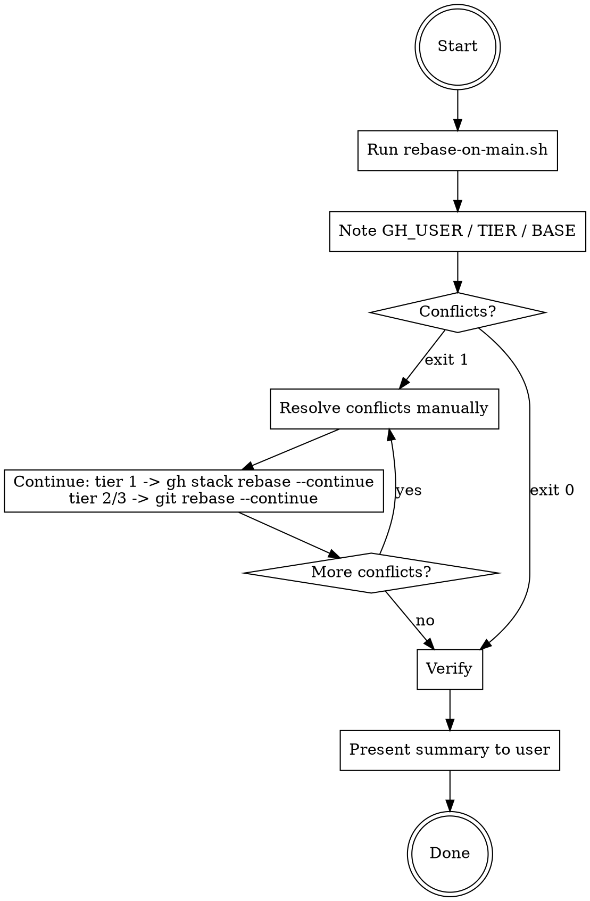

# Rebase on Main

Rebase the current feature branch on the base its PR actually targets, resolve conflicts, verify the result, and present a summary for the user to approve before force pushing.

**The base is not always main.** If the branch is a layer in a stack, its PR targets the layer below it, and rebasing on `main` would flatten the stack. The script resolves the real base; the rest of this skill keys off which tier it picked.

## Process



## Steps

### 1. Rebase

Run `rebase-on-main.sh`, which sits beside this SKILL.md in the skill's own folder, by
that folder's full path:

```bash
<this skill's folder>/rebase-on-main.sh
```

The script prints `GH_USER=`, `TIER=`, `BASE=` and `CMD=` before acting, so you always know which account and which path ran. Pass `--dry-run` to see the resolution without touching anything.

**Which gh account.** Every base lookup runs through `gh`, so the script first works out which logged-in account can read this repo:

| `GH_USER=` | What happened |
|------------|---------------|
| the active account | `gh repo view` succeeded as-is. Nothing special. |
| a different account | The active account is locked out of this repo, so the script switched to the first logged-in account that can read it |
| `none` | No logged-in account can read this repo. Every `gh` answer below it is worthless, `BASE=` included |

Pass `--gh-user <account>` to skip the probe and pin one account, for example `--gh-user monalisa` on `acme/*` repos. It errors if that account is not logged in. Tokens stay inside the pipeline and are never printed.

**Which base.** With an account settled, the script picks one of three rebase strategies:

| Tier | Condition | What it does |
|------|-----------|--------------|
| 1 | `gh stack view` succeeds — branch is in a locally-tracked GitHub stack | `gh stack rebase --downstack`: cascading rebase of trunk and every layer *below* the current branch |
| 2 | PR targets a non-default branch, no local stack tracking | `git rebase --onto origin/$base $(git merge-base --fork-point origin/$base HEAD)` |
| 3 | PR targets main, or there is no PR | Checks out main, pulls, checks out the branch, `git rebase main` |

Tier 1 needs the `github/gh-stack` extension (public preview since 2026-07-30). If it isn't installed, `gh stack view` fails and the script falls through to tier 2 or 3 — no error.

When no PR base comes back the script falls back to main, and the note it prints tells you which kind of fallback you got. `no PR for this branch, checked as <account>` is trustworthy: an account that can read the repo looked, and there is no PR. `no logged-in gh account can read this repo` is not. There the base is unknown, not main, and you should re-run with `--gh-user <account>` before believing anything downstream of it.

If the rebase hits conflicts (exit 1), resolve them manually:
- `git diff --name-only --diff-filter=U` to list conflicted files
- Read conflict markers, understand both sides, pick the correct resolution
- `git add <resolved-files>`, then continue — **the continue command depends on the tier**:
  - Tier 1: `gh stack rebase --continue` (back out with `gh stack rebase --abort`, which restores every branch)
  - Tiers 2 and 3: `git rebase --continue`
- Repeat until rebase completes

**Never resume a tier 1 rebase with `git rebase --continue`.** The stack tooling is driving a multi-branch cascade; finishing one step behind its back leaves the remaining layers unrebased and the stack's own state out of sync with the branches.

**Tier 1 moves parent branches locally, and that is expected** — the current branch cannot sit on latest main unless the layers under it do too. This skill does not push them (see step 3). Do not "fix" a parent branch beyond what the cascade did.

**Before resolving a semantic conflict, know what the branch is *for*.** A purely textual resolution can silently undo the branch's entire purpose — e.g. taking main's side on a line the branch deliberately changed reverts the feature. Read the PR title/description or the branch's commit messages (`git log "origin/$BASE".."$BRANCH" --format='%s%n%b'`) first, and resolve so the branch's intent survives. When the base and the branch changed the *same* concept in different directions, the branch's direction usually wins (that's why the branch exists) — but flag it as a concern in the summary.

### 2. Verify

Run the project's test suite to catch breakage from the rebase. Fix and commit as needed.

If tests fail, **run the range-diff (see step 3) before diagnosing** — a post-rebase failure is most often caused by how a conflict resolution changed the branch's own patch, not by the test itself. See what the rebase actually changed before concluding anything about the cause.

### 3. Take stock and present summary

**Do not force push automatically.** Instead, present a summary to the user so they can verify the rebase is correct before pushing.

Include in the summary:

1. **Actions taken** — list every action since the skill started: rebase result, conflicts resolved (which files, which resolution), test failures fixed, commits created
2. **What changed in the branch's own work** — use `git range-diff` to compare the branch's commits before and after the rebase. This shows only how the branch's own patches changed, excluding commits from the base:
   ```bash
   BRANCH=$(git branch --show-current)
   BASE=<the BASE= the script printed>
   git range-diff $(git merge-base "origin/$BRANCH" "origin/$BASE").."origin/$BRANCH" "origin/$BASE"..HEAD
   ```
   This compares the old commit sequence (pre-rebase) to the new one (post-rebase) and highlights modifications to each commit. Unchanged commits show as "=", modified ones show the diff of the diff.

   **Use the resolved base, not `main`.** On a stacked branch, a range-diff against `main` includes every commit from the layers below, reporting the parents' work as this branch's own — which buries the handful of commits the user actually needs to check.
3. **Stack context** — only when `BASE` is not main:
   - The detected base branch, and that the PR targets it rather than main
   - Which other stack layers changed locally (compare the pre- and post-rebase SHA lists the script printed)
   - How far the base trails main: `git rev-list --count "origin/$BASE..origin/main"`
   - An explicit note that **parent PRs were not pushed** — they need their own runs, from the bottom of the stack upward
4. **Potential concerns** — highlight anything that warrants attention:
   - Conflict resolutions where the choice was ambiguous
   - Test failures that required code changes to fix
   - Files that were modified in both the branch and the base (higher risk of incorrect resolution)
   - Any unexpected changes in the diff
   - `GH_USER=none`: no account could read the repo, so the base was never actually confirmed and the rebase may have targeted the wrong branch

It is more important to list **everything** than to get the highlighting of concerns perfect. The user needs a complete picture.

End by asking the user whether to proceed with `git push --force-with-lease`.

**Push the current branch only — never `gh stack push`.** `gh stack push` force-pushes every active layer in the stack, turning one approved rebase into several rewritten PRs. Even in tier 1, where parents moved locally, only the current branch gets published.

### 4. Log to agent-changes.md (if present)

If `agent-changes.md` exists in the repo root, append a short summary of the rebase outcome to the **end of the file**. The github-orchestrator pre-writes a `## [...]` header before invoking this skill, so just append your summary; it will land under the most recent header. **Do not write your own `## [...]` header.**

Include: the result (clean / conflicts resolved / tests fixed), the files involved in any non-trivial conflict resolution, and any concerns from the summary above. Keep it tight — it's a breadcrumb for the user reading the dashboard, not a replacement for the full summary you give them in the chat.

If `agent-changes.md` doesn't exist, skip this step — you're being run interactively, not from the orchestrator.

## Common Mistakes

| Mistake | Fix |
|---------|-----|
| Using `--force` instead of `--force-with-lease` | Always use `--force-with-lease` — it fails if someone else pushed to the branch |
| Force pushing without user confirmation | Always present the summary and wait for approval |
| `git rebase --continue` during a tier 1 stack rebase | Use `gh stack rebase --continue` — plain git finishes one step and leaves the rest of the cascade undone |
| Assuming the base is main because `gh` errored | Read `GH_USER=`. `none` means the base is *unknown*, not main. Re-run with `--gh-user <account>` |
| `gh stack push` to publish the rebase | Push only the current branch — `gh stack push` rewrites every layer's PR |
| Force pushing a child and expecting its PR base to change | A push moves commits, not the PR's base. Retargeting is `gh stack modify` or editing the PR base |
| Rebasing a child before its parent | Wasted work — rebase from the bottom of the stack upward, or let tier 1's `--downstack` cascade do it |
